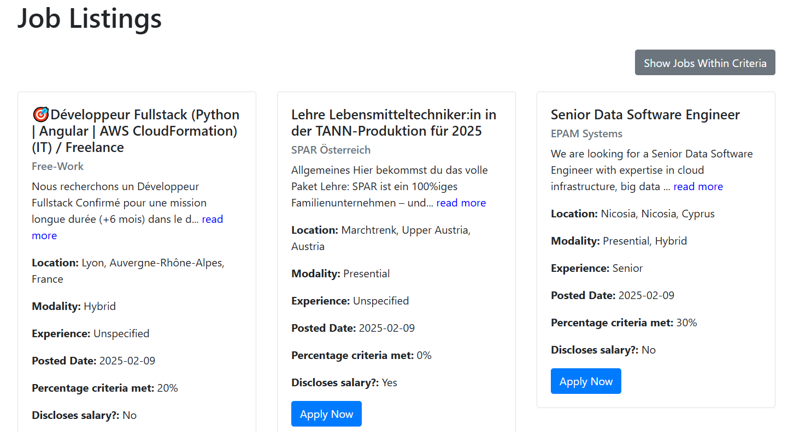

# Enhancement to LinkedIn JOB SEARCH

Anybody who has used LinkedIn for job seeking has probably realized that it doesn't work wonders.
The filters are not consistent.
Try searching for just remote jobs, and LinkedIn will show you all kind.
Try searching for a job position, and LinkedIn will display unrelated roles.
Try searching for experience level, and LinkedIn will list from Executive to Junior positions.

I'll tell you more: try filtering by keywords...THERE IS NO POSSIBILITY WHATSOEVER.

Thus, in order to help whoever is in the job hunting mood, I have developed an simple and straightforward tool
that will take the following filters:
- Job position/s
- Keyword/s
- Experience Levels
- Modality
- Type of Job
- Location

It runs few searches in parallel, leveraging multithreading, and displays the results. The user has then the option to narrow the list down to the ones that meet the criteria.

As explain above, LinkedIn internal "API" quite ignores the filters. Therefore there is a tailored data treatment step to enhaces the search.

>[!IMPORTANT]
>This application is NOT supported by LinkedIn. Using it for commertial purposes might violate LinkedIn's terms of Service. I am not resposible of any product developed based on this.
>LinkedIn internal API caps the search to 1000 outputs.
>The tool scraps position posted in last 24 hours, in order to show relevant offers.
>The ultimate architecture is to run - on schedule - the app once a day and store the jobs of interest.

>[!NOTE]
>Development phase. Don't expect flawless performance.s
> I want to thank the user *tomquirk* for providing his code https://github.com/tomquirk/linkedin-api which has been essential to the development of this app.

## Instructions
You will need LinkedIn credentials in order to run searches.
Set up the environment variables LINKEDIN_USER and LINKEDIN_SECRET, which stand for your email and your password to log in to the official LinkedIn page.

*I STRONGLY SUGGEST TO READ TOMQUIRK README FILE TO FULLY UNDERSTAND HOW THE AUTHENTICATION AND FETCH WORK.*

After this, just run:
```
python main.py
```
and open http://127.0.0.1:5000 in any browser.

## FUTURE IMPROVEMENTS
+ See SPRINTS document.
+ Build application.

## DEMO
Main UI:


Search:


Jobs filtered by user's criteria:


